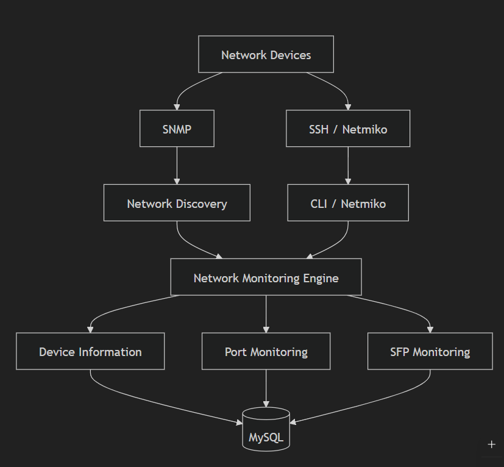

# Network Monitoring Engine

<p align="center">
  
</p>

<h3 align="center">
  Automated Network Discovery, Port Monitoring & SFP Optical Power Monitoring
</h3>

<p align="center">
  A Python-based network monitoring engine developed to automate
  network discovery, device identification, switch port inventory,
  port status monitoring, and SFP optical power monitoring.
</p>

<p align="center">


</p>

<p align="center">


</p>

---

## Overview

Managing a large Layer-2 network manually becomes difficult when hundreds of switches and thousands of interfaces need to be monitored.

The **Network Monitoring Engine** was developed to automate the initial network monitoring workflow:

- Discover network devices
- Detect SNMP availability
- Identify device OEM and characteristics
- Discover switch ports
- Monitor port operational status
- Collect SFP optical RX/TX power
- Store monitoring information in MySQL
- Execute monitoring stages through a Linux pipeline

The project combines **SNMP-based monitoring** with **SSH/CLI-based device interrogation**.

> **Project Status: On Hold**
>
> This repository preserves the working implementation and development history of the project.
>
> The project may be evolved into a larger, next-generation Network Management System (NMS) in the future.

---

# Features

## 1. Network Discovery

The discovery stage scans configured network ranges and identifies reachable network devices.

### Capabilities

- Network range scanning
- ICMP availability detection
- SNMP availability detection
- Device OEM detection
- SNMP community detection
- Device last-seen tracking
- Initial device registration

---

## 2. Device Identification

The device identification stage collects detailed information from discovered devices.

### Information collected

- Hostname
- System description
- System Object ID
- Device model/entity information
- Device identification information

SNMP is used where available, with SSH/CLI access used for supported switch workflows.

---

## 3. Switch Port Discovery

The switch port discovery stage automatically builds a port inventory.

### Information includes

- Physical interfaces
- Port names
- Port characteristics
- Port media information
- Switch-specific interface information

The project combines **SNMP and SSH/CLI** mechanisms depending on the monitoring requirement.

---

## 4. Port Status Monitoring

The port status stage monitors the operational state of switch interfaces.

### Provides visibility into

- Port UP
- Port DOWN
- Interface availability
- Switch port health

The purpose is to make large-scale Layer-2 interface monitoring easier than manually checking individual ports.

---

## 5. SFP Optical Power Monitoring

The SFP monitoring stage collects optical information from supported interfaces.

### Monitoring

- SFP RX optical power
- SFP TX optical power
- Optical power thresholds
- Interface-level SFP information

This capability was developed to help identify optical problems such as degraded or failing transceivers.

---

# Monitoring Architecture



# Development Workflow

The project was developed incrementally through five major stages.

```text
                         Network Devices
                                |
                                v
                    +----------------------+
                    | Step 1               |
                    | Network Discovery    |
                    +----------+-----------+
                               |
                               v
                    +----------------------+
                    | Step 2               |
                    | Device Identification|
                    +----------+-----------+
                               |
                               v
                    +----------------------+
                    | Step 3               |
                    | Switch Port Discovery|
                    +----------+-----------+
                               |
                               v
                    +----------------------+
                    | Step 4               |
                    | Port Status          |
                    +----------+-----------+
                               |
                               v
                    +----------------------+
                    | Step 5               |
                    | SFP Optical Power    |
                    +----------+-----------+
                               |
                               v
                         MySQL Database
```

---

# Project Lineage

This project represents an earlier stage of the author's network monitoring development.

```text
                 Network Engineering Experience
                              |
                              v
                 Network Monitoring Engine
                              |
                              v
                    Automated Discovery
                              |
                              v
                  Device Identification
                              |
                              v
                Port / Interface Monitoring
                              |
                              v
                   SFP Optical Monitoring
                              |
                              v
                     Future NMS Platform
```

The repository is intentionally preserved as a historical and technical foundation for future NMS development.

---

# Technology Stack

<p align="center">


</p>

| Component | Technology |
|---|---|
| Programming Language | Python 3.12 |
| Operating Environment | Linux |
| Database | MySQL |
| Network Monitoring | SNMP |
| Network Automation | Netmiko |
| Remote Access | SSH |
| Configuration | python-dotenv |
| Version Control | Git / GitHub |

---

# Network Automation

The project uses **Netmiko** for SSH-based network device interaction.

Netmiko provides an abstraction for interacting with network devices through SSH and is used for vendor-specific CLI operations.

The architecture combines:

```text
SNMP
 |
 +-- Discovery
 +-- Device information
 +-- Port information
 +-- Monitoring data

SSH / Netmiko
 |
 +-- CLI interrogation
 +-- Vendor-specific information
 +-- Port information
 +-- Device operations
```

---

# Project Structure

```text
network-monitoring-engine/
│
├── README.md
├── .gitignore
├── .gitattributes
├── .env.example
├── requirements.txt
│
├── db_utils.py
├── snmp_utils.py
├── run.sh
│
├── step1_network_discovery.py
├── step2_device_identify.py
├── step3_switch_ports.py
├── step4_port_status.py
└── step5_sfp_power.py
```

---

# Component Description

### `step1_network_discovery.py`

Responsible for:

- Network discovery
- ICMP detection
- SNMP detection
- OEM detection
- Initial device registration

### `step2_device_identify.py`

Responsible for:

- Hostname discovery
- System description
- System Object ID
- Device model information
- Device identification

### `step3_switch_ports.py`

Responsible for:

- Switch port discovery
- Interface inventory
- Port characteristics
- Vendor-specific CLI operations

### `step4_port_status.py`

Responsible for:

- Port operational status
- Interface availability
- Port health information

### `step5_sfp_power.py`

Responsible for:

- SFP detection
- RX optical power
- TX optical power
- Optical threshold monitoring

### `snmp_utils.py`

Common SNMP-related functionality used by the monitoring components.

### `db_utils.py`

Common MySQL database connectivity functionality.

### `run.sh`

Linux pipeline execution script.

The current pipeline executes:

```text
+-----------------------------+
| Step 3                      |
| Switch Port Discovery       |
+-------------+---------------+
              |
              v
+-----------------------------+
| Step 4                      |
| Port Status Monitoring      |
+-------------+---------------+
              |
              v
+-----------------------------+
| Step 5                      |
| SFP Optical Power           |
+-----------------------------+
```

The script also prevents overlapping executions through a Linux file-lock mechanism.

---

# Configuration

The project uses environment variables for configuration.

Create a local `.env` file based on:

```text
.env.example
```

Example:

```env
DEBUG=False
MAX_THREADS=15
RX_ALERT_THRESHOLD=-20.0

LOG_DIR=/opt/netmon/logs

NETWORKS=192.0.2.0/24

SNMP_COMMUNITIES=CHANGE_ME

DB_HOST=127.0.0.1
DB_USER=netmon
DB_PASS=CHANGE_ME
DB_NAME=network_monitor

SW_SSH_USER=CHANGE_ME
SW_SSH_PASS=CHANGE_ME
SW_SSH_SECRET=CHANGE_ME
```

## Security

The following are intentionally excluded from Git:

```text
.env
venv/
logs/
backup/
__pycache__/
```

Never commit:

- Database passwords
- SNMP communities
- SSH passwords
- SSH enable secrets
- API keys
- Production network information
- Internal logs

---

# Python Dependencies

Dependencies are defined in:

```text
requirements.txt
```

Current direct dependencies:

```text
mysql-connector-python==9.5.0
python-dotenv==1.2.1
netmiko
```

Python standard-library modules do not need to be included in `requirements.txt`.

---

# Installation

## 1. Clone the repository

```bash
git clone <repository-url>
cd network-monitoring-engine
```

## 2. Create a Python virtual environment

```bash
python3 -m venv venv
```

## 3. Activate the environment

```bash
source venv/bin/activate
```

## 4. Install dependencies

```bash
pip install -r requirements.txt
```

## 5. Create configuration

```bash
cp .env.example .env
```

Edit `.env` with your environment-specific configuration.

---

# Execution

Individual stages can be executed using:

```bash
python step1_network_discovery.py
python step2_device_identify.py
python step3_switch_ports.py
python step4_port_status.py
python step5_sfp_power.py
```

The monitoring pipeline can be executed with:

```bash
./run.sh
```

---

# Development History

| Stage | Component | Status |
|---|---|---|
| Step 1 | Network Discovery | Completed |
| Step 2 | Device Identification | Completed |
| Step 3 | Switch Port Discovery | Completed |
| Step 4 | Port Status Monitoring | Completed |
| Step 5 | SFP Optical Power Monitoring | Completed |

---

# Project Status

```text
Network Discovery             [██████████] Completed
Device Identification         [██████████] Completed
Switch Port Discovery         [██████████] Completed
Port Status Monitoring        [██████████] Completed
SFP Optical Power Monitoring  [██████████] Completed

Current Project Status: ON HOLD
```

This repository is intentionally preserved as a stable snapshot of the working implementation.

---

# Future Direction

The current project provides a foundation for a much larger Network Management System.

## Potential future development includes

### Device Management

- Automatic device onboarding
- Automatic device classification
- Vendor abstraction
- Device capability detection

### Interface Monitoring

- Automatic interface discovery
- Port status monitoring
- Port traffic monitoring
- Bandwidth utilization
- Top interfaces
- Interface error monitoring
- Interface health

### Hardware Monitoring

- CPU utilization
- Memory utilization
- Fan health
- Power supply health
- Temperature sensors
- Hardware alarms

### Intelligent Monitoring

- SNMP/CLI intelligent selection
- Vendor-specific monitoring
- Automatic monitoring profile selection
- Event correlation
- Root-cause analysis
- Alert deduplication

### Network Intelligence

- Topology discovery
- Link relationship detection
- Service impact analysis
- Network dependency mapping

### Platform

- Web-based management interface
- REST API
- Historical metrics
- Alerting engine
- Role-based access
- Multi-site monitoring
- Network-wide dashboards

---

# Why This Project Exists

The original objective was simple:

> Make large-scale network device and interface monitoring easier to operate and maintain.

The project focuses on automation rather than requiring every device and interface to be manually configured.

This principle will remain important in the future evolution of the project.

---

# License

This project is currently published for portfolio, research, and development purposes.

A formal open-source license may be added in a future release.

---

# Author

**Venkatesh Ramalingam**

Network Engineering | Network Monitoring | Automation | DevOps
